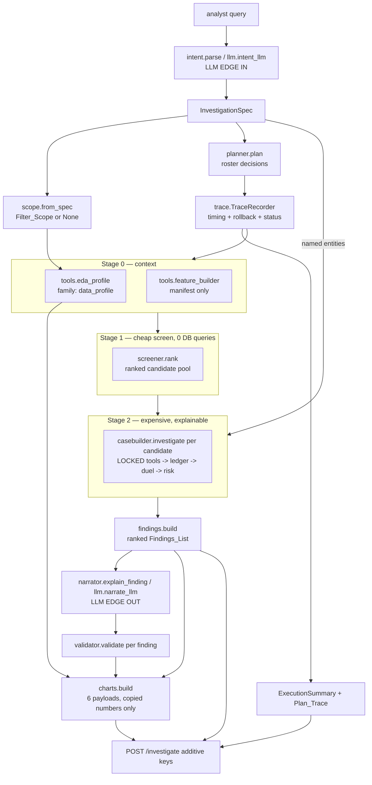

# Design Document

## Overview

This feature makes five things reachable by the agent that the codebase either already has or is one small module away from: exploratory data analysis, engineered features as a visible plan step, query-filter scoping, a ranked multi-item findings list for broad queries, and real per-tool telemetry. It also derives presentation payloads from data already held, and rewrites `FRONTEND_BACKEND_DATA_CONTRACT.md` so the document describes the real API.

The scoring core is untouched. `duel.py`, `risk.py`, and `hypotheses/library.yaml` keep every weight, importance, band and formula. Everything new is either (a) a new module, (b) a new keyword-only parameter with a behaviour-preserving default, or (c) a new top-level response key. The two locked anchors (Phase 2 fixture = 86.65, real ring = 53.18) are pinned by tests *before* any adjacent code changes.

### Research and measurement performed for this design

Every cost number below was measured on this repository, on this machine (Apple silicon laptop, in-memory DuckDB, Python 3.11), against HI-Small in `data/raw/`, using throwaway probes that were deleted afterwards.

| Measurement | Value |
|---|---|
| HI-Small transactions / distinct accounts | 5,078,345 rows / 515,088 accounts |
| Warmup: `load_dataset` / `build_profiles` / `PeerModel` | 22.6 s / 0.7 s / 0.3 s (background thread, already paid) |
| Rank the full 515,088-row feature table in pandas | **137 ms, 0 DB queries** |
| `casebuilder.investigate()` today, top-in_degree candidates (n=40, depth 1) | median **1,108 ms**, median **89 DuckDB round-trips**, max 554 round-trips / 7,633 ms |
| Same with batched expansion (see D4), depth 1 | median **169 ms**, **≤10 round-trips** |
| Same with batched expansion, depth 2 | median **211 ms**, mean 221 ms, max 626 ms, **≤11 round-trips** |
| EDA aggregate scans, unfiltered, 5.08M rows | **309 ms** total across 6 queries |
| EDA aggregate scans, filtered (`payment_format='cash' AND month=9`) | **181 ms** |
| Filtered `COUNT(*)` probe | 17 ms (490,891 rows matched) |
| Phase 2 fixture risk / counterfactual sequence | 86.65 / `full 86.65, -peer_deviation 70.25, -flow_through 63.90, -network_convergence 64.15, -temporal_coordination 70.65, -typology_rule 77.65, -flow_through-network_convergence 41.40` |
| `ring_Trans.csv` hub `0500|C1` full `investigate()` risk | **56.00** (see D2 — *not* 53.18) |
| `case_Trans.csv` hub `0500|C1` full `investigate()` risk | 45.54 |

The headline finding: **the per-candidate cost is dominated by a per-feeder loop, not by the tools.** `casebuilder.investigate()` issues one `_out_degree` query per feeder, and real HI-Small hubs have 70–545 feeders. The tools themselves cost 7 round-trips and ~82 ms. This is why Requirement 7 criterion 3 (a bounded round-trip count per candidate) is unreachable without the batching refactor described in D4.

---

## Design Decisions and Resolutions

### Approved before design (encoded, not re-litigated)

**A1 — Empty findings return 200, not 404.** A query that yields an empty `Findings_List` returns HTTP 200 with `findings: []`, `case: null`, `no_findings_reason: "<stated reason>"`, the full `plan_trace`, the `execution` summary, and the `charts` payloads (each marked unavailable with its reason). 404 is reserved for exactly one condition: a named account absent from the loaded dataset (`ACCOUNT_NOT_FOUND`).

> **Divergence D1 (deliberate).** This overrides **Requirement 12 criterion 7** (which forbids a success body with a null `case`) and **Requirement 12 criterion 8** (404 + `NO_FINDINGS`). The `NO_FINDINGS` error code is not implemented. **Requirement 14 criterion 25** loses `NO_FINDINGS` from the error-code table; **Requirement 14 criterion 26** becomes "document the single 404 case (`ACCOUNT_NOT_FOUND`) and, separately, the empty-findings 200 body shape". **Requirement 12 criterion 22**'s test is replaced by a test asserting the 200 empty-findings shape. Rationale: a 404 discards the Plan_Trace and chart payloads on exactly the path where an analyst most wants to see what was searched, and overloads one status with two unrelated meanings.

**A2 — No LLM score contribution, ever, including on the empty path.** Requirement 10 criterion 15 and all of Requirement 13 stand as written. When `findings` is empty the response carries no risk score, tier or escalation anywhere, and nothing LLM-derived is substituted. The LLM keeps exactly two call sites: `llm.intent_llm` (from `orchestrator._parse_spec`) and `llm.narrate_llm` (from `orchestrator._narrate`). No new module imports `llm`.

### Resolved in this design

**Assumption 1 — Screening and cost cutoffs.**

| Setting | Default | Arithmetic |
|---|---|---|
| `max_candidates` | **500** | The screener sorts the whole 515,088-row feature table for 137 ms regardless of the cap, so the cap only bounds how deep the funnel may dig. 500 = 20× the investigation cap, leaving room to skip benign/indeterminate candidates without exhausting the pool. The pool itself is a list of node strings (≈15 KB). |
| `max_investigations` | **25** | 25 × 211 ms (measured median, depth 2, post-batching) ≈ **5.3 s**. 25 × 626 ms (measured worst candidate, depth 2) ≈ **15.7 s**. The top of the pool holds the widest hubs, i.e. the slowest candidates, so the worst case is the realistic case for a demo. 25 rows is also a readable triage queue. |
| `max_roundtrips_per_candidate` | **16** | Fixed tool cost 8 = peer_comparison 1 + rapid_pass_through 2 + graph_motif 2 (`ego_subgraph` depth 1) + benign_signals 2 + isolation_forest 1. Expansion (post-batching) = `trace_depth` batched inbound queries + 1 outbound + 1 batched out-degree = 3/4/5 at depth 1/2/3. Total 11/12/13. Cap 16 leaves headroom for the optional column-presence and filtered-count probes. Measured maxima: 10 (depth 1), 11 (depth 2). |
| `broad_query_budget_s` | **30.0** | EDA 0.35 s + filtered count 0.02 s + feature reuse 0 s + ranking 0.14 s + 25 candidates. Typical ≈ **5.8 s**; worst observed ≈ **16.3 s**. 30 s is ~1.8× the worst observed and well under the frontend's 90 s timeout. It is asserted as a *budget*, not a target: Requirement 7 criterion 10 fails only if the run exceeds it. |

All four live on `Settings` (frozen dataclass) with module-level constants and an `Settings.from_env()` override path so a demo operator can lower them without a code change.

**Assumption 2 — Candidate_Screener ranking signal.**

Eligibility filter first (deterministic, features only): keep rows with `in_count >= 1` and `in_degree >= 2`. An account with fewer than two payers cannot be a consolidation hub, and the dropped count is reported in the Plan_Trace.

Rank score over the eligible rows, using percentile ranks (`Series.rank(pct=True, method="average")`) so the signal is scale-free and needs no thresholds:

```
rank = 0.50·pr(in_degree) + 0.20·pr(in_count) + 0.15·pr(in_sum) + 0.10·pr(velocity) + 0.05·pr(io_ratio)
```

Order: descending `rank`, ties (compared at 1e-9) broken by ascending `bank|account`.

Honest positioning, carried into the code comment and the contract document: **on AMLworld, `in_degree` alone is near-optimal by construction** — the ground truth labels rings by fan-in topology (`docs/plan.md`, Phase 3d), so no engineered-feature combination can beat a fan-in threshold there. The composite is not a precision claim. It is a **recall funnel**: its only job is to put real hubs inside the top `max_investigations` so the expensive, explainable stage runs on them. `in_degree` keeps half the weight precisely so the order stays close to the near-optimal order, while `velocity` and `io_ratio` give a small lift to accounts that consolidate fast or retain nothing but do not have extreme degree. No labels are read; the only inputs are the ten engineered features.

**Assumption 3 — Filter propagation depth.** The binding constraint is `peer_comparison`: it reads a `PeerModel` fitted with MiniBatchKMeans over *full-history* profiles, and its z-score is taken against that cluster's median/MAD. Narrowing its slice would change the clusters, the medians and the MADs, which moves `peer_deviation` strength and therefore both anchors. So it runs unfiltered, and says so.

| Tool | Filter_Scope applied? | Reason recorded in the Plan_Trace |
|---|---|---|
| `eda_profile` | **Yes** | Profiling the slice the analyst asked about is the entire purpose. |
| `feature_builder` | **No** | Features are full-history by definition; the peer model and the screener are calibrated on them. Requirement 4 criterion 3 also mandates returning the warmup table unchanged. |
| `candidate_screener` | **No** | Ranks the full-history feature table. Filters scope the *evidence and the profile*, not the candidate ranking. |
| `peer_comparison` | **No** | Reads the full-history `PeerModel`. Filtering would move the locked anchors (Phase 2 = 86.65, real ring = 53.18). |
| `rapid_pass_through` | **Yes** | Ratio is computed entirely from the queried slice; no external calibration. |
| `graph_motif` | **Yes** | Fan-in shape is slice-local; the analyst asked about a slice. |
| `benign_signals` | **Yes** | Its families must describe the *same* slice as `flow_through`; a duel between a full-history benign family and a filtered suspicious family compares incommensurable evidence. |
| `near_threshold` | **Yes** | "cash deposits in March" is precisely this tool's question. |
| `isolation_forest` | **No** | The persisted model was fitted on full-history profiles; a filtered profile row is off-distribution. Neutral family, so no score impact either way. |
| Case expansion — `ego_subgraph` | **Yes** | Ring membership follows the question the analyst asked. |
| Case expansion — feeder out-degree gate | **No** | The earn-your-flag gate asks about the counterparty's *whole* behaviour. A filtered out-degree would make a salary payer look mule-thin and break the Phase 3b exclusion. |

Anchor-safety argument, stated once and relied on throughout: **`Filter_Scope` is `None` whenever `spec.filters` is empty, and a `None` scope contributes no SQL text at all.** Every pre-feature test, both anchors, and every integration case run with empty filters, so their SQL is byte-identical to today's. Only a query that actually names a format or a month sees the new predicate, and no anchor is a filtered query.

Accepted tradeoff, stated because it is real: filtering `benign_signals` shrinks `stability` and `recurrence` for narrow slices, which can push a filtered query toward `suspicious` relative to the same account unfiltered. Mitigation is disclosure, not silence — the Plan_Trace carries the applied filters and the profiled slice span, and the narration names the filter.

**Assumption 4 — Neutral_Family names.** `data_profile` (emitted by the EDA_Tool) and `feature_coverage` (reserved for the Feature_Builder). Verified absent from every fingerprint in `hypotheses/library.yaml` (`peer_deviation`, `flow_through`, `network_convergence`, `temporal_coordination`, `recurrence`, `stability`, `retention`, `typology_rule`) and from every profile in `risk.RISK_PROFILES` (`peer_deviation`, `flow_through`, `network_convergence`, `temporal_coordination`, `typology_rule`). The existing `anomaly` family is the precedent. Both names live in one registry, `schemas.NEUTRAL_FAMILIES`, and a unit test asserts the registry is disjoint from the union of all fingerprint families and all risk-weight keys — so a future edit cannot quietly make a neutral family score-bearing.

The Feature_Builder **emits no EvidenceRecord.** It aggregates profiles, so it cannot cite real `tx_ids`, and the proof-carrying rule forbids a record without them. Its output surfaces through the feature manifest and its Plan_Trace row. `feature_coverage` is reserved so that if a later change does give it tx-level proof, the family is already pinned as neutral.

**Assumption 5 — Chart payload schema and bounds.** Six typed payloads (§ Components 3.9), each wrapped in the same envelope (`id`, `title`, `available`, `reason`, body). The provisional bounds are **confirmed unchanged: 50 evidence rows, 25 transaction identifiers per row.** Reasoning from real data: a smurfing case emits 6–7 evidence records today, so 50 rows is pure headroom and the bound will effectively never trigger; the binding bound is the per-row transaction list, because `peer_comparison` on a 545-feeder hub cites every inbound transaction (hundreds to thousands of ids). 25 ids per row keeps the whole chart set in the tens of kilobytes while still showing an analyst enough to spot-check, and each row reports its true total count so nothing is silently truncated. The contract document is written from these same models, so both describe one shape.

### Divergences discovered while designing (flagged, not hidden)

**D1 — Empty findings status code.** See A1 above.

**D2 — Requirement 1 criterion 2 cannot be satisfied as written.** The criterion asks for a Unit_Suite test asserting the **ring fixture** hub scores **53.18**. Measured today: `ring_Trans.csv` hub `0500|C1` scores **56.00** (3-tool subset and full `investigate()` both), and `case_Trans.csv` hub `0500|C1` scores 45.54. 53.18 is a *real HI-Small ring* number recorded in Phase 3a, not a fixture number. Resolution:
- The Unit_Suite pins the fixture anchor at **56.00 ± 0.01** for `ring_Trans.csv` / `0500|C1`, and additionally pins 45.54 ± 0.01 for `case_Trans.csv` / `0500|C1`. These are hermetic and are the ones that actually guard refactors.
- 53.18 becomes an **integration anchor**: a gated test records the risk for a named HI-Small ring hub into `backend/tests/cases/anchors.json` and compares it to 53.18, *reporting* a divergence with before/after values rather than failing, until the node identity behind 53.18 is confirmed once against the dataset. The node is not recorded anywhere in the repo today; the first integration run fixes it.
- Both anchors stay the comparison bars; neither is moved.

**D3 — Requirement 3 criterion 6's closure scan fails today, before this feature.** The import closure of `orchestrator.run` already contains two held-out-symbol occurrences: `schemas.Transaction.is_laundering` (a declared model field) and `config.paths_for`'s `f"{variant}_Patterns.txt"` path template. Resolution: the scan strips comments and docstrings, then matches source lines, with a **two-entry documented allowlist** keyed on module + exact line content:
1. `nexus/schemas.py` — the `is_laundering` field declaration on `Transaction` (declarative only; no agent-path module reads the attribute or the column).
2. `nexus/config.py` — the `patterns=` path construction in `paths_for` (consumed only by `profile.py` and the eval harness, both outside the closure).
Any third occurrence fails the test with the module name and the matched symbol. The three new modules are scanned with **no** allowlist (Requirement 3 criterion 4), and the closure is additionally asserted not to import `nexus.ground_truth` or `nexus.profile` (criterion 7). Consequence for the EDA_Tool: it must name its twelve columns explicitly and never `SELECT *`, or the string scan and the held-out rule both break.

**D4 — Requirement 7 criterion 3 requires a cost refactor of `casebuilder` expansion.** Measured round-trips per candidate today: median **89**, max **554** — not the 5–8 assumed. The fixed tool cost is 7; the excess is one `_out_degree` query per feeder plus, at `trace_depth ≥ 2`, one inbound query per frontier node inside `ego_subgraph`. Two batching changes fix it:
- `graph._out_degrees(con, nodes)` — one grouped query returning `{node: COUNT(DISTINCT receiver)}` for a list of nodes, replacing the per-feeder loop. Same definition, same values.
- `graph.ego_subgraph` — one batched inbound query per **depth level** (`WHERE (to_bank, receiver_account) IN (...)`) instead of one per frontier node, with `ORDER BY tx_id` for a deterministic edge-attribute write order.

Measured effect: median 1,108 ms → **169 ms** (depth 1) and round-trips 89 → **10**; depth 2 lands at 211 ms / 11 round-trips.

This touches neither `strength` nor `direction`, so Requirement 1 criterion 4's recalibration report is an equality claim, and it is verified rather than asserted: a test compares the loop implementation against the batched one on both fixtures and on a sampled set of real nodes, asserting identical `members`, `feeders_included`, `beneficiaries`, `excluded`, and identical evidence values. Anchor report to be filled at implementation time in the task notes:

| Anchor | Before | After | Changed? |
|---|---|---|---|
| Phase 2 fixture | 86.65 | *(expected 86.65 — fixture evidence, no tools involved)* | expected: no |
| `ring_Trans.csv` hub | 56.00 | *(expected 56.00)* | expected: no |
| Real HI-Small ring | 53.18 (Phase 3a record) | *(to be measured)* | expected: no |

`ORDER BY tx_id` does change one thing honestly: when a `(src, dst)` pair repeats, the surviving edge attributes become deterministic instead of DuckDB-order dependent. That can change *which* `tx_id` `graph_motif` cites for a duplicated edge (never how many, never the strength). This is a determinism improvement required by Requirement 12 criterion 16 and is called out here so it is not discovered later.

**D5 — `case` for a broad query.** `case` is the `Case` of the highest-ranked finding. For a query that names an entity, the finding set is that entity, so `case` is byte-identical to today's response. This is what keeps every pre-feature API test green.

**D6 — Requirement 15 criterion 1's pre-feature count is stale.** Measured now, before any change: `cd backend && .venv/bin/python -m pytest -q` reports **41 passed, 6 skipped** in 3.0 s. The criterion's "at least twenty-five passed" bar is therefore weaker than reality. The design adopts the measured count as the bar: **41 passed, 6 skipped, 0 failed, 0 errored** is the floor after this feature, plus the new tests. The 25 in the requirement comes from the Phase 5 note in `docs/plan.md`, which the suite has since outgrown.

**D7 — Latent month-filter wart (noted, not fixed here).** `intent._filters` matches month names by substring, so a query containing "maybe" would set `month: "May"`. No current test or anchor query is affected. Fixing it means a word-boundary regex, which changes `spec.filters` for such queries; it is left out of this feature's scope and recorded here so the tasks phase can decide.

---

## Architecture

### Where the new capability sits



Everything between the two LLM edges is deterministic. The two new stages sit *before* the locked engine and never modify it: Stage 0 produces context, Stage 1 produces an ordered list of seeds, Stage 2 is today's `investigate()` called in a loop.

### Two-stage funnel, end to end

```mermaid
sequenceDiagram
    participant O as orchestrator.run
    participant R as TraceRecorder
    participant E as eda_profile
    participant F as feature_builder
    participant S as screener
    participant C as casebuilder.investigate
    participant N as narrator + validator

    O->>O: spec = parse(query); scope = from_spec(spec.filters)
    O->>O: plan = planner.plan(spec)
    O->>R: open(plan, budget_ms)
    alt eda selected
      O->>R: step("eda_profile")
      R->>E: run(con, scope, ledger_ctx, settings)
      E-->>R: EdaProfile (rows_in = profiled count)
    end
    alt feature_builder selected
      O->>R: step("feature_builder")
      R->>F: run(con, prebuilt=profiles)
      F-->>R: (features, manifest) rows_out = account count
    end
    alt entities present
      O->>O: targets = entities present in features
    else broad query
      O->>R: step("candidate_screener")
      R->>S: rank(features, spec, max_candidates)
      S-->>R: pool (0 DB queries)
      O->>O: targets = pool
    end
    loop target in targets, until max_investigations
      O->>C: investigate(con, peers, node, typology, depth, settings, model, features, scope=scope, recorder=R)
      C->>R: per-tool step(); on error rollback ledger to mark, status=failed
      C-->>O: Case (locked duel + risk on the surviving ledger)
      O->>O: broad query and kind in {benign, indeterminate} -> exclude
    end
    O->>N: per finding: template explanation, LLM only if it validates
    O->>O: findings sorted by risk desc, node asc
    O->>O: charts.build(top finding, findings, eda, scores)
    O-->>O: RunResult (case = top finding's case, or None)
```

### Failed-tool degradation

A tool failure must cost its evidence and nothing else. `TraceRecorder.step()` wraps every tool invocation:

1. Record `mark = ledger.mark()` (the current record count).
2. Start `perf_counter_ns()`.
3. Call the tool. On success: record `status="ran"`, duration (floored at 0.001 ms so a fast tool is never indistinguishable from a skipped one), `rows_in`/`rows_out` or `None`.
4. On any exception: `ledger.rollback(mark)` — every record the tool appended is dropped, including partial output from a multi-record tool like `benign_signals`. Record `status="failed"` with a reason naming the tool and the lost analysis, no stack trace, no file path. Continue with the remaining tools.

Because rollback truncates an append-only list, claim ids stay dense (`CL-01`, `CL-02`, …) and the all-success path mints exactly the ids it does today. The surviving ledger is what the duel and the risk engine see, so a failed tool contributes nothing to the verdict (Requirement 8 criterion 14), and `tools_run` is derived from `status == "ran"`, so no consumer can read the verdict as having used it (criterion 15). If every selected tool fails, the ledger is empty, the run returns an empty `Findings_List` with a reason naming the failed tools, and no risk score or escalation is reported anywhere (criterion 16).

### Plan_Trace aggregation for broad queries

A broad query invokes the same tool 25 times. Requirement 8 criterion 1 wants exactly one entry per roster tool, so entries aggregate:

- `duration_ms` = sum over invocations (wall-clock, measured).
- `invocations` = call count; named in the reason ("ran on 25 candidates").
- `rows_in` / `rows_out` = summed, or `null` when the tool is not row-countable.
- `status` = `ran` if at least one invocation succeeded (the reason names the failure count when some failed), `failed` if every invocation failed, `skipped` if the planner declined it.

### Module layout

New modules, all under `backend/nexus/`:

| Module | Responsibility |
|---|---|
| `nexus/scope.py` | `FilterScope` model, `from_spec()`, `sql()` → `(predicate, params)`, `applied()`, `count(con)`. The single place a filter becomes SQL. |
| `nexus/tools/eda_profile.py` | EDA_Tool. Twelve explicit columns, 7–8 aggregate queries, `EdaProfile` result, one `data_profile` EvidenceRecord. |
| `nexus/tools/feature_builder.py` | Feature_Builder. Wraps `profiles.build_profiles()`, returns `(DataFrame, FeatureManifest)`; passthrough when a prebuilt table is supplied. |
| `nexus/screener.py` | Candidate_Screener. Pure pandas over the feature table, zero DB access. |
| `nexus/trace.py` | `TraceRecorder`: roster-backed timing, status, rows, ledger rollback, cost telemetry. |
| `nexus/findings.py` | Case → `Finding` mapping, exclusion rules, ranking and tie-break, `Findings_List` assembly. |
| `nexus/charts.py` | Chart_Builder. Copies numbers out of the run result; computes nothing. |

Existing modules, with the intended diff:

| Module | Change | Size |
|---|---|---|
| `planner.py` | Roster becomes typed entries (`id`, `label`, `purpose`, `needs_features`, `traverses_graph`, `scoring`). New `plan(spec) -> Plan`. `plan_for(spec)` kept as a thin wrapper over `plan()` returning the same `(run, skipped)` tuple. | moderate, additive |
| `orchestrator.py` | New control flow (scope, recorder, funnel, per-finding narration, charts). `RunResult` gains `plan_trace`, `findings`, `charts`, `execution`, `eda`, `feature_manifest`, `no_findings_reason`; `case` becomes `Case | None`. Existing fields keep their meaning. | largest diff |
| `casebuilder.py` | `investigate(...)` gains keyword-only `scope=None`, `recorder=None`. `_run_tools` routes through the recorder when present. Expansion uses the batched helpers. Public signature and `Case` semantics unchanged. | small |
| `graph.py` | `ego_subgraph` batches inbound per depth level and orders by `tx_id`; accepts an optional `scope`. New `out_degrees(con, nodes)` grouped helper. | small |
| `ledger.py` | `mark()` and `rollback(mark)`. | 6 lines |
| `narrator.py` | New `explain_finding(finding_fields, spec) -> str` (≤400 chars) and `finding_facts()` for the LLM edge. `narrate_template`/`facts` untouched. | additive |
| `schemas.py` | New models (below) + `NEUTRAL_FAMILIES`. No existing model touched. | additive |
| `config.py` | Four new `Settings` fields + constants + `from_env()`. | small |
| `api/app.py` | `_serialize` gains additive keys; `/health` gains two presence indicators; empty-findings path returns the 200 shape. | small |
| `api/state.py` | **No change.** Warmup already builds the profile table the Feature_Builder reuses and the screener ranks, and already holds the lock the funnel runs under. |
| `risk.py`, `duel.py`, `hypotheses/library.yaml`, `profiles.py`, `profile.py`, `validator.py`, `intent.py`, `peers.py`, `anomaly.py`, existing `tools/*.py` | **No change** (`profile.py` byte-identical per Requirement 3 criterion 5; existing tools gain a filter predicate only by being passed a scope-aware SQL fragment — see below). | none |

One nuance on "existing tools unchanged": `rapid_pass_through`, `graph_motif`, `benign_signals` and `near_threshold` do need to accept a scope. To keep their diffs to a single line each, `scope.py` exposes `where(scope, *extra)` which returns a SQL `WHERE` fragment plus params, and each tool composes its existing predicate with it. With `scope=None` the fragment is empty and the SQL string is identical to today's.

---

## Components and Interfaces

### 3.1 `scope.py` — Filter_Scope

```python
class FilterScope(BaseModel):
    payment_format: str | None = None      # canonical normalized value, e.g. "Cash"
    month: str | None = None               # canonical month name, e.g. "March"
    month_number: int | None = None        # 1..12, derived

    @property
    def active(self) -> bool
    def applied(self) -> dict[str, str]          # {"payment_format": "Cash", "month": "March"}
    def sql(self) -> tuple[str, list]            # ("", []) when inactive
    def count(self, con) -> int                  # one COUNT(*) round trip, 17 ms measured

def from_spec(spec: InvestigationSpec) -> FilterScope | None
def where(scope: FilterScope | None, *clauses: str) -> tuple[str, list]
```

- `payment_format` → `lower(payment_format) = lower(?)` (Requirement 5 criterion 1: case-insensitive exact match, everything else excluded).
- `month` → `month(timestamp) = ?`, which matches the named month in **any** year present (criterion 2).
- Both → both predicates `AND`ed (criterion 3).
- Unknown month name or unknown format value → the scope is still built and still applied; it simply selects zero rows, and the stated reason names the key and the value that matched nothing (criteria 7, 8).

### 3.2 `tools/eda_profile.py` — EDA_Tool

```python
COLUMNS = ("timestamp", "from_bank", "sender_account", "to_bank", "receiver_account",
           "amount_paid", "amount_received", "payment_currency", "receiving_currency",
           "payment_format", "amount_base", "cross_currency")

class MissingColumnError(ToolError): ...          # names the offending column

def run(con, scope: FilterScope | None, ledger: EvidenceLedger,
        settings: Settings | None = None) -> EdaProfile
```

Query plan (measured 309 ms unfiltered / 181 ms filtered over 5.08M rows):

1. `DESCRIBE transactions` → assert all twelve columns present, else raise `MissingColumnError` **before** touching the ledger (Requirement 2 criterion 17: ledger left byte-identical).
2. One combined scalar query: profiled count, cross-currency count, null-timestamp count, non-positive-amount count, min/max timestamp, distinct calendar days.
3. Distinct account count over the `UNION` of sender and receiver pairs.
4. Amount statistics over `amount_base`: count, min, max, mean, `MEDIAN`, `QUANTILE_CONT(...,0.95)`, sum.
5. Three distributions (`payment_format`, `payment_currency`, `receiving_currency`), each `ORDER BY count DESC, category ASC`, truncated to 20 with a remainder entry carrying the collapsed category count and their combined transaction count.
6. Unpriced-currency count plus up to 20 currency names, by descending transaction count, using `Settings.fx_per_usd` as the known-rate set.
7. `SELECT tx_id ... LIMIT 50` inside the scope, for the evidence record's proof list.

Result shape is `EdaProfile` (§4). Absent-vs-zero is expressed with `None`, never `0` (criteria 12, 16). Zero-row slice → counts zero, empty distributions, `amounts=None`, `time_span=None`, **no** evidence record. Non-empty slice → exactly one `data_profile` EvidenceRecord with 1–50 in-slice `tx_ids`, `direction` derived from the cross-currency rate against a 0.5 midpoint, `strength` = the rate clamped to [0,1]. Because `data_profile` is in no fingerprint and no weight profile, both values are inert by construction. Returns everything; prints nothing.

### 3.3 `tools/feature_builder.py` — Feature_Builder

```python
FEATURES = ("out_count", "out_sum", "out_degree", "in_count", "in_sum",
            "in_degree", "txn_count", "span_days", "velocity", "io_ratio")

def run(con, prebuilt: pd.DataFrame | None = None) -> tuple[pd.DataFrame, FeatureManifest]
```

- `prebuilt` supplied (the API path, always) → returned unchanged, zero DB queries, manifest `source="warmup"`.
- Otherwise → `profiles.build_profiles(con)`, then project to exactly the ten columns in `FEATURES` order (`build_profiles` also returns `bank` and `acct`, which are dropped; index parity and column values are unchanged, satisfying Requirement 4 criterion 7).
- Zero-transaction slice → zero-row frame retaining all ten columns, full manifest, `rows_out=0`, no error.
- No `is_laundering`, no `SELECT *`; the module is scanned with no allowlist.

### 3.4 `screener.py` — Candidate_Screener

```python
RANK_WEIGHTS = {"in_degree": 0.50, "in_count": 0.20, "in_sum": 0.15,
                "velocity": 0.10, "io_ratio": 0.05}

class Candidate(BaseModel):
    node: str
    rank: float
    features: dict[str, float]

def rank(features: pd.DataFrame, spec: InvestigationSpec,
         max_candidates: int) -> CandidatePool
```

Pure pandas: eligibility mask, five `rank(pct=True)` calls, weighted sum, sort by `(-rank, node)`, head `max_candidates`. Zero DB queries by construction (Requirement 7 criterion 1) — the function has no connection parameter, which is the strongest available guarantee. `max_candidates == 0` → empty pool, and the zero cap is the stated reason (criterion 4). Cap ≥ eligible rows → the whole eligible set, no error (criterion 5).

### 3.5 `planner.py` — roster and per-intent selection

```python
class RosterTool(BaseModel):
    id: str
    label: str            # 1..60 chars
    purpose: str
    needs_features: bool = False
    traverses_graph: bool = False
    scoring: bool = False      # emits a family in a fingerprint or a weight profile

ROSTER: tuple[RosterTool, ...]   # declaration order = skipped-entry order

class PlanDecision(BaseModel):
    tool: str
    selected: bool
    reason: str                 # 1..200 chars
    selecting_intents: list[str]

def plan(spec) -> Plan
def plan_for(spec) -> tuple[list[str], list[tuple[str, str]]]   # unchanged signature
```

Roster (9 nodes — the real one, replacing the aspirational 14 in the contract document):

| id | label | scoring | needs_features | traverses_graph |
|---|---|---|---|---|
| `eda_profile` | Data Profile (EDA) | no | no | no |
| `feature_builder` | Feature Builder | no | no | no |
| `candidate_screener` | Candidate Screener | no | **yes** | no |
| `peer_comparison` | Peer Comparison | **yes** | no | no |
| `rapid_pass_through` | Rapid Pass-Through | **yes** | no | no |
| `graph_motif` | Graph Motif / Path Trace | **yes** | no | **yes** |
| `benign_signals` | Benign Signals | **yes** | no | no |
| `near_threshold` | Near-Threshold Deposits | **yes** | no | no |
| `isolation_forest` | Isolation Forest (neutral) | no | **yes** | no |

`isolation_forest` is on the roster because Requirement 8 criterion 1 wants every executable tool visible; it runs today invisibly inside `casebuilder` when a model artifact exists. Its family is neutral, so surfacing it changes no score. Skip reason when absent: "no trained model artifact in models/".

Selection, derived from `intent`, `typology`, and `len(entities)` only (Requirement 13 criterion 5, Requirement 9 criterion 11):

| intent value | selects |
|---|---|
| `detect` | typology scoring route; `eda_profile` **only when `entities` is empty**; `feature_builder` + `candidate_screener` when `entities` is empty |
| `trace` | typology scoring route + every `traverses_graph` tool, traversal bounded to `spec.trace_depth` clamped to 1..3 |
| `explain` | typology scoring route; **declines** `eda_profile`, with a reason naming the entity count |
| `monitor` | typology scoring route |

Typology routes keep today's scoring sets exactly: `smurfing` → `{peer_comparison, rapid_pass_through, graph_motif, benign_signals}`; `structuring` → `{peer_comparison, near_threshold}` (Requirement 9 criteria 12, 15). Unknown typology → the documented `smurfing` default plus a trace note naming the unrecognized value and the substituted route (criterion 10). Selection is the union across intent values, each tool listed once (criterion 8), and a tool selected by any intent is selected even if another declines it, with the selecting intent named in the reason (criterion 9). `eda_profile` is declined only when *no* intent value selects it — which is exactly the `explain`-with-entities case Requirement 9 criteria 2 and 3 describe, so criteria 8/9 and 2/3 do not collide.

`feature_builder` is selected iff a selected tool has `needs_features` (i.e. `candidate_screener` or `isolation_forest`), and is ordered ahead of them (Requirement 4 criteria 5, 6). Note the deliberate line: `peer_comparison` consumes the **fitted PeerModel artifact**, a warmup input, not the feature table — otherwise `feature_builder` would always be required and criterion 5's skip path would be dead code.

### 3.6 `trace.py` — TraceRecorder

```python
class TraceRecorder:
    def __init__(self, plan: Plan, budget_ms: float): ...
    @contextmanager
    def step(self, tool: str, ledger: EvidenceLedger | None = None,
             rows_in: int | None = None) -> Iterator[StepHandle]
    def note(self, text: str) -> None
    def roundtrips(self, node: str, n: int) -> None
    def entries(self) -> list[PlanTraceEntry]      # ran/failed first, then skipped in roster order
    def cost(self) -> CostTelemetry
```

`StepHandle` lets a tool report `rows_out` and per-step reason detail. Durations use `perf_counter_ns` and are floored at 0.001 ms for `ran` (Requirement 8 criterion 11) and forced to exactly 0.0 for `skipped` (criterion 10). Round-trip counting wraps the DuckDB connection in a thin counting proxy for the duration of one candidate's investigation, which is how the observed per-candidate count reaches the Plan_Trace (Requirement 7 criterion 13) — the same proxy technique used by the measurement probes for this design.

### 3.7 `casebuilder.py` and `graph.py`

```python
def investigate(con, peers, seed, typology="smurfing", trace_depth=1, settings=None,
                anomaly_model=None, profiles=None, *,
                scope: FilterScope | None = None,
                recorder: TraceRecorder | None = None) -> Case
```

Keyword-only additions with behaviour-preserving defaults: existing positional callers (`orchestrator`, four test modules, `scripts/*`) are unaffected, and `Case` field semantics are unchanged (Requirement 6 criterion 9). With `scope=None` and `recorder=None` the function behaves exactly as today apart from the batched expansion of D4.

```python
def ego_subgraph(con, center, depth=1, scope=None) -> nx.DiGraph   # depth+1 round trips
def out_degrees(con, nodes) -> dict[str, int]                      # 1 round trip, unfiltered
```

The out-degree gate keeps `THIN_MAX = 2` and stays unfiltered (Assumption 3), so the Phase 3b salary-payer exclusion holds for filtered and unfiltered runs alike.

### 3.8 `findings.py` and `narrator.explain_finding`

```python
def to_finding(case, spec, scores, rank: int) -> Finding
def build(cases, spec, *, broad: bool) -> tuple[list[Finding], str | None]
```

Rules:
- Broad query (no named entity): drop `benign` and `indeterminate` candidates (Requirement 6 criterion 12), counting them as excluded.
- Named entities: keep every present entity including `benign` and `indeterminate` (criterion 6); an entity absent from the feature table yields no finding and a Plan_Trace reason naming it (criterion 11).
- Order by risk descending compared at two decimals, ties by ascending node (criterion 4); `rank` is assigned after sorting.
- Every finding carries at least one evidence record with at least one real `tx_id` (criterion 10); a finding whose evidence cites nothing is a bug the integration suite catches.

`narrator.explain_finding` builds a ≤400-character template line naming the typology, the winning hypothesis label (omitted for `indeterminate`), the tier, the escalation, and at least one intent term restated from the spec. The LLM path reuses `llm.narrate_llm` through the existing `orchestrator._narrate` seam, one call per finding, each validated by `validator.validate(text, finding.case)` — which is per-finding scoped, so a number that traces only to *another* finding's evidence is reported unsupported (Requirement 10 criterion 9). Any rejection, timeout, empty response, or rate-limit falls back to the template for that finding; a rate-limit stops further LLM calls for the rest of the run (Requirement 13 criterion 12).

### 3.9 `charts.py` — Chart_Builder

`build(top_finding, findings, eda, scores, risk_result, counterfactuals, max_investigations) -> ChartSet`, with six typed payloads and one envelope each:

| Payload | Body | Source | Unavailable when |
|---|---|---|---|
| `risk_contribution` | `entries[{family, contribution}]`, desc by contribution, ties by family name | `RiskResult.contributions` verbatim | fewer than two contributing families |
| `counterfactual` | `entries[{label, score}]` in source order | `risk.counterfactuals()` verbatim | no contributing family |
| `hypothesis_scoreboard` | `entries[{id,label,kind,raw,normalized,band,matched,contradicted}]`, desc by normalized, ties by id | `duel.score_all()` verbatim | no findings |
| `findings_table` | `rows[{node,risk,tier,escalation}]`, findings order, ≤ `max_investigations` | `Findings_List` verbatim | empty findings |
| `evidence_table` | `rows[{family,claim,calculation,value,direction,strength,tx_ids(≤25),tx_count}]`, ledger order, ≤50 rows, `total_records` | top finding's evidence | no findings |
| `data_profile` | `payment_format` distribution (≤20 + remainder) and `amounts` summary | `EdaProfile` only | EDA declined or failed |

Hard rule enforced by design and by test: the only arithmetic permitted is `round(x, 2)`. No ratio, no rescaling, no re-normalisation, no new aggregate (Requirement 11 criterion 6). Unavailable payloads are emitted with zero entries, `available=false`, and a reason naming the missing source; the other five are unchanged (criterion 9). No model artifact is loaded and no attribution library is imported (criterion 8).

### 3.10 API surface

`POST /investigate` — retained keys `spec`, `plan`, `case`, `narrative`, `validated`, `unsupported`, `sources`, `audit` keep their meaning and type (`case` is `null` only on the empty-findings path, per A1). Added top-level keys:

| Key | Type |
|---|---|
| `plan_trace` | `PlanTraceEntry[]` — one per roster tool |
| `findings` | `Finding[]` — ranked |
| `no_findings_reason` | `string \| null` |
| `charts` | `ChartSet` — the six payloads |
| `execution` | `ExecutionSummary` — query echo, intent, typology, entities, filters, counts, cost telemetry, notes |
| `eda` | `EdaProfile \| null` |
| `feature_manifest` | `FeatureManifest \| null` |

`GET /health` — retained keys unchanged, plus `eda_tool: bool` and `feature_builder: bool` presence indicators (Requirement 12 criterion 17). Health still answers during warmup without touching the dataset, so the sub-second requirement is structurally satisfied.

Error paths are unchanged except for the deleted `NO_FINDINGS` code: `ACCOUNT_NOT_FOUND` 404, `WARMING_UP`/`ENGINE_ERROR` 503, `EMPTY_QUERY`/`UNRESOLVABLE_QUERY` 400, `INVESTIGATION_FAILED` 500, `VALIDATION_ERROR` 422. The 500 envelope keeps carrying only an exception *type* name, never a message, path or stack trace (Requirement 12 criterion 15).

---

## Data Models

All new models are Pydantic v2 and live in `schemas.py` alongside the existing ones. No existing model is modified. `Transaction`, `EvidenceRecord`, `Hypothesis`, `InvestigationSpec`, `AuditReceipt`, `Case` and `PatternInstance` stay exactly as they are.

```python
NEUTRAL_FAMILIES: frozenset[str] = frozenset({"anomaly", "data_profile", "feature_coverage"})

Status = Literal["ran", "skipped", "failed"]
Tier = Literal["low", "medium", "high"]
Escalation = Literal["monitor", "review", "report"]


# ---------- filter scope ----------
class FilterScope(BaseModel):
    model_config = ConfigDict(frozen=True)
    payment_format: str | None = None
    month: str | None = None
    month_number: int | None = Field(None, ge=1, le=12)


# ---------- plan + telemetry ----------
class PlanTraceEntry(BaseModel):
    tool: str
    label: str = Field(..., min_length=1, max_length=60)
    status: Status
    reason: str = Field(..., min_length=1, max_length=200)
    duration_ms: float = Field(..., ge=0.0)
    rows_in: int | None = Field(None, ge=0)      # None == not applicable
    rows_out: int | None = Field(None, ge=0)     # None == not applicable
    invocations: int = Field(0, ge=0)
    filters_applied: dict[str, str] = Field(default_factory=dict)
    filters_not_applied: list[str] = Field(default_factory=list)


class CostTelemetry(BaseModel):
    max_candidates: int = Field(..., ge=0)
    max_investigations: int = Field(..., ge=0)
    max_roundtrips_per_candidate: int = Field(..., ge=0)
    candidate_pool_size: int = Field(0, ge=0)
    candidates_eligible: int = Field(0, ge=0)
    candidates_dropped: int = Field(0, ge=0)
    investigated: int = Field(0, ge=0)
    excluded: int = Field(0, ge=0)
    returned: int = Field(0, ge=0)
    roundtrips_max_per_candidate: int = Field(0, ge=0)
    roundtrips_total: int = Field(0, ge=0)
    wall_clock_ms: float = Field(0.0, ge=0.0)
    budget_ms: float = Field(..., ge=0.0)
    within_budget: bool = True


class ExecutionSummary(BaseModel):
    query: str
    intent: list[str] = Field(default_factory=list)
    typology: str
    typology_recognized: bool = True
    entities: list[str] = Field(default_factory=list)
    entities_note: str = ""            # "no account entity detected" when empty
    filters: dict[str, str] = Field(default_factory=dict)
    filters_note: str = ""             # "no filter applied" when empty
    scoped_transactions: int | None = None      # filtered count, None when unfiltered
    total_transactions: int | None = None
    cost: CostTelemetry
    notes: list[str] = Field(default_factory=list)   # failed tools, absent entities, route substitution


# ---------- EDA ----------
class CategoryCount(BaseModel):
    category: str
    count: int = Field(..., ge=0)

class Distribution(BaseModel):
    column: str
    entries: list[CategoryCount] = Field(default_factory=list, max_length=20)
    remainder_categories: int = Field(0, ge=0)
    remainder_count: int = Field(0, ge=0)

class AmountSummary(BaseModel):
    count: int = Field(..., ge=0)
    min: float
    max: float
    mean: float
    median: float
    p95: float
    sum: float

class TimeSpan(BaseModel):
    first: datetime
    last: datetime
    span_days: int = Field(..., ge=1)
    active_days: int = Field(..., ge=0)

class DataQuality(BaseModel):
    null_timestamps: int = Field(0, ge=0)
    non_positive_amounts: int = Field(0, ge=0)
    unpriced_currency_transactions: int = Field(0, ge=0)
    unpriced_currencies: list[str] = Field(default_factory=list, max_length=20)

class EdaProfile(BaseModel):
    scope_active: bool = False
    scope: dict[str, str] = Field(default_factory=dict)
    transactions: int = Field(..., ge=0)
    accounts: int = Field(..., ge=0)
    distributions: dict[str, Distribution] = Field(default_factory=dict)
    cross_currency_count: int = Field(0, ge=0)
    cross_currency_rate: float | None = Field(None, ge=0.0, le=1.0)
    amounts: AmountSummary | None = None       # None (absent), never a zero-filled object
    time_span: TimeSpan | None = None
    quality: DataQuality = Field(default_factory=DataQuality)


# ---------- features ----------
class FeatureDefinition(BaseModel):
    name: str
    definition: str = Field(..., min_length=1, max_length=200)

class FeatureManifest(BaseModel):
    features: list[FeatureDefinition] = Field(..., min_length=10, max_length=10)
    cluster_features: list[str] = Field(..., min_length=9, max_length=9)
    accounts: int = Field(..., ge=0)
    source: Literal["warmup", "built"]


# ---------- screening ----------
class Candidate(BaseModel):
    node: str
    rank: float
    features: dict[str, float] = Field(default_factory=dict)

class CandidatePool(BaseModel):
    candidates: list[Candidate] = Field(default_factory=list)
    eligible: int = Field(0, ge=0)
    dropped: int = Field(0, ge=0)
    max_candidates: int = Field(..., ge=0)
    signal: dict[str, float]              # RANK_WEIGHTS, echoed for auditability
    reason: str = ""


# ---------- findings ----------
class Finding(BaseModel):
    rank: int = Field(..., ge=1)
    node: str
    risk: float = Field(..., ge=0.0, le=100.0)
    tier: Tier
    escalation: Escalation
    winning_kind: VerdictKind
    winning_hypothesis: str = ""
    hypothesis_label: str = ""
    confidence: str
    explanation: str = Field(..., min_length=1, max_length=400)
    explanation_source: Literal["llm", "template"] = "template"
    validated: bool = True
    unsupported: list[str] = Field(default_factory=list)
    evidence: list[EvidenceRecord] = Field(default_factory=list)
    case: Case


# ---------- charts ----------
class ChartEnvelope(BaseModel):
    id: str
    title: str
    available: bool = True
    reason: str | None = None

class RiskContributionEntry(BaseModel):
    family: str
    contribution: float

class RiskContributionChart(ChartEnvelope):
    entries: list[RiskContributionEntry] = Field(default_factory=list)

class CounterfactualEntry(BaseModel):
    label: str
    score: float

class CounterfactualChart(ChartEnvelope):
    entries: list[CounterfactualEntry] = Field(default_factory=list)

class ScoreboardEntry(BaseModel):
    id: str
    label: str
    kind: str
    raw: float
    normalized: float
    band: str
    matched: list[str] = Field(default_factory=list)
    contradicted: list[str] = Field(default_factory=list)

class ScoreboardChart(ChartEnvelope):
    entries: list[ScoreboardEntry] = Field(default_factory=list)

class FindingsTableRow(BaseModel):
    node: str
    risk: float
    tier: Tier
    escalation: Escalation

class FindingsTableChart(ChartEnvelope):
    rows: list[FindingsTableRow] = Field(default_factory=list)

class EvidenceTableRow(BaseModel):
    family: str
    claim: str
    calculation: str
    value: float
    direction: Direction
    strength: float
    tx_ids: list[int] = Field(default_factory=list, max_length=25)
    tx_count: int = Field(0, ge=0)

class EvidenceTableChart(ChartEnvelope):
    rows: list[EvidenceTableRow] = Field(default_factory=list, max_length=50)
    total_records: int = Field(0, ge=0)
    rows_omitted: int = Field(0, ge=0)

class DataProfileChart(ChartEnvelope):
    payment_format: Distribution | None = None
    amounts: AmountSummary | None = None

class ChartSet(BaseModel):
    risk_contribution: RiskContributionChart
    counterfactual: CounterfactualChart
    hypothesis_scoreboard: ScoreboardChart
    findings_table: FindingsTableChart
    evidence_table: EvidenceTableChart
    data_profile: DataProfileChart
```

`RunResult` (a dataclass, not a Pydantic model, so it stays cheap) gains:

```python
@dataclass
class RunResult:
    spec: InvestigationSpec
    tools_run: list[str]                  # derived from status == "ran"
    tools_skipped: list[tuple[str, str]]  # derived from status == "skipped"
    case: Case | None                     # top finding's case; None only when findings == []
    narrative: str
    validated: bool
    unsupported: list[str]
    audit: AuditReceipt                   # + plan_trace field
    narrator_source: str = "template"
    intent_source: str = "deterministic"
    # new, additive:
    findings: list[Finding] = field(default_factory=list)
    no_findings_reason: str | None = None
    plan_trace: list[PlanTraceEntry] = field(default_factory=list)
    execution: ExecutionSummary | None = None
    charts: ChartSet | None = None
    eda: EdaProfile | None = None
    feature_manifest: FeatureManifest | None = None
```

`AuditReceipt` gains one field, `plan_trace: list[PlanTraceEntry]`, and keeps `tools_run` / `tools_skipped` with their current meaning and type (Requirement 8 criteria 22, 23).

---

## Correctness Properties

*A property is a characteristic or behavior that should hold true across all valid executions of a system — essentially, a formal statement about what the system should do. Properties serve as the bridge between human-readable specifications and machine-verifiable correctness guarantees.*

Randomised property testing applies to this feature: the new components are pure functions over data (a predicate builder, an aggregate profiler, a feature projection, a ranking function, a payload copier) plus a deterministic trace/degradation state machine. Documentation content (Requirement 14), suite-level outcomes (Requirement 15 criteria 1, 10, 11) and real-data metrics are covered by example, parity and integration tests instead.

The prework analysed 226 criteria and, after redundancy elimination, 25 properties remain. Each is implemented by exactly one property-based test.

### Property 1: Locked calibration is frozen

*For all* typologies in the hypothesis library and *for all* profiles in the risk weight tables, the hypothesis identifiers, hypothesis kinds, per-family importances, family weight names and family weight values equal the pinned pre-feature snapshot within 0.001, and every risk profile's weights sum to 1.0 within 0.001.

**Validates: Requirements 1.5, 1.6**

### Property 2: Anchor computations are deterministic and hermetic

*For any* number of repeated in-process evaluations of the two fixture anchors, every computed risk score, tier, escalation and counterfactual sequence is identical, and no file outside `backend/tests/fixtures/` and no network socket is accessed.

**Validates: Requirements 1.8, 15.13**

### Property 3: Neutral families are inert

*For any* evidence ledger and *for any* additional evidence record whose family is in `NEUTRAL_FAMILIES` with any direction and any strength in [0,1], the risk score, tier, escalation, contributions and every hypothesis score produced from the extended ledger are identical to those produced from the original ledger.

**Validates: Requirements 2.14, 9.13**

### Property 4: Held-out artefacts are unreachable from the agent path

*For all* modules in the import closure of `orchestrator.run` (excluding tests, `backend/scripts/`, `nexus/eval/`), with comments and docstrings stripped and the two documented allowlist entries excluded, no source line references `Patterns.txt`, `parse_patterns`, `GroundTruth` or `is_laundering`, and no module in that closure imports `nexus.ground_truth` or `nexus.profile`; *for all* three new modules the same holds with no allowlist, and every transaction column they reference is in the twelve-column allowlist.

**Validates: Requirements 2.3, 3.1, 3.2, 3.3, 3.4, 3.6, 3.7**

### Property 5: EDA metrics equal a direct recomputation of the profiled slice

*For any* fixture transaction slice and *for any* Filter_Scope (including no scope), every metric the EDA_Tool reports — transaction count, distinct account count, cross-currency count and rate, amount count/min/max/mean/median/p95/sum, first and last timestamp, span days, active days, null-timestamp count, non-positive-amount count and unpriced-currency count — equals the value computed directly from the scope-satisfying rows of that slice, and every emitted transaction identifier belongs to that slice.

**Validates: Requirements 2.1, 2.2, 2.4, 2.5, 2.7, 2.8, 2.9, 2.10, 2.11, 2.13, 2.15, 2.19**

### Property 6: EDA distributions are ordered, bounded and lossless

*For any* profiled slice, each reported distribution is ordered by descending count with ties broken by ascending category name, holds at most 20 entries, and the sum of its entry counts plus its remainder count equals the profiled transaction count, with the remainder category count equal to the number of collapsed categories.

**Validates: Requirements 2.6, 11.5**

### Property 7: Absent is distinguishable from zero

*For any* profiled slice, a metric with no contributing value is reported as absent (`None`) rather than as zero, and *for any* slice holding zero transactions the profile reports zero counts, empty distributions, absent amount statistics, absent time-span coverage, and appends no evidence record; *for any* transaction column removed from the table, the tool raises a typed error naming that column and leaves the ledger with the same records in the same order.

**Validates: Requirements 2.12, 2.16, 2.17**

### Property 8: Feature table parity and manifest completeness

*For any* transaction slice, the Feature_Builder's built table has exactly the ten named columns in order, a unique index equal to the account set observed in that slice, integer columns equal exactly and float columns equal within 1e-9 to `profiles.build_profiles()` on the same slice, and a manifest carrying exactly one 1–200 character definition per column plus `CLUSTER_FEATURES` in the order `profiles.py` exports.

**Validates: Requirements 4.1, 4.2, 4.7, 4.8, 4.10**

### Property 9: Prebuilt feature tables pass through untouched and unqueried

*For any* prebuilt feature table supplied to the Feature_Builder, the returned table has the same index and the same column set as the supplied table, the observed database round-trip count for that call is zero, and the Plan_Trace reason names the warmup as the source with rows-out equal to the returned row count.

**Validates: Requirements 4.3, 4.4, 4.9**

### Property 10: Filter_Scope selects exactly the transactions satisfying its predicates

*For any* fixture slice and *for any* combination of `payment_format` and `month` filter values, including values absent from the data and mixed letter casing, the set of transactions selected by the Filter_Scope equals the set satisfying case-insensitive exact format equality and named-calendar-month equality in any year; every transaction identifier emitted by a filter-applied tool is in that set; the reported filtered count equals its size; and *for any* scope selecting zero transactions the run returns an empty findings list with no risk score and no escalation, and a reason naming each filter key with its applied value.

**Validates: Requirements 5.1, 5.2, 5.3, 5.4, 5.5, 5.6, 5.7, 5.8, 5.9, 5.10**

### Property 11: The candidate screener is a deterministic, bounded, database-free ranking

*For any* engineered feature table and *for any* `InvestigationSpec`, two successive rankings produce identical membership, identical order and identical rank values; the pool is ordered by descending rank with ties broken by ascending node identifier; its length equals `min(max_candidates, eligible_rows)` and its members are the top-ranked prefix; the observed database round-trip count attributable to ranking is zero; and a `max_candidates` of zero yields an empty pool.

**Validates: Requirements 6.1, 6.2, 7.1, 7.4, 13.3**

### Property 12: Findings are well formed, correctly ordered and correctly accounted

*For any* run, every finding carries a node identifier, a risk score in [0,100], a tier from {low, medium, high}, an escalation from {monitor, review, report}, non-empty explanation text and at least one evidence record citing at least one real transaction identifier; findings are ordered by descending risk compared at two decimals with ties broken by ascending node identifier; a broad run contains no finding whose winning kind is benign or indeterminate while an entity-scoped run contains exactly one finding per present named entity regardless of kind, with each absent entity named in the trace; and the reported counts satisfy `investigated == returned + excluded` and `returned == len(findings)`.

**Validates: Requirements 6.3, 6.4, 6.5, 6.6, 6.8, 6.10, 6.11, 6.12**

### Property 13: Investigation cost is bounded per candidate and never global

*For any* candidate pool, any investigation cap and any trace depth in 1..3, the observed database round-trips for each investigated candidate is at most the configured maximum, candidates beyond the cap register zero round-trips, every NetworkX graph built has a node count bounded by the seed neighbourhood at that depth, every pandas frame materialised by the new tools has a row count bounded by the scoped or seed-bounded result, and the trace reports the observed per-candidate round-trip count and the measured wall clock.

**Validates: Requirements 7.2, 7.3, 7.5, 7.7, 7.8, 7.9, 7.13**

### Property 14: The Plan_Trace is complete, well formed and correctly ordered

*For any* `InvestigationSpec`, the Plan_Trace holds exactly one entry per roster tool with no tool absent or repeated; every entry carries a roster identifier, a 1–60 character label, a status in {ran, skipped, failed}, a 1–200 character reason containing no stack trace and no source path, and a duration greater than or equal to zero that is exactly zero for `skipped` and strictly greater than zero for `ran`; row counts are present and non-negative for row-countable tools and null — distinguishable from zero — otherwise; and entries with status `ran` or `failed` precede entries with status `skipped`, the former in attempted order and the latter in roster declaration order.

**Validates: Requirements 8.1, 8.2, 8.3, 8.4, 8.5, 8.6, 8.7, 8.8, 8.9, 8.10, 8.11, 8.24, 8.25, 9.1, 4.5, 4.6**

### Property 15: A failed tool costs its evidence and nothing else

*For any* single tool made to raise at any point in its execution, including after it has appended part of its output, the run completes, every remaining planned tool is still attempted, that tool's Plan_Trace status is `failed` with a reason naming it, no evidence record originating from it appears in the scoring ledger, the resulting risk score equals the score computed from the same run with that tool's families absent, and the tool does not appear in `AuditReceipt.tools_run`.

**Validates: Requirements 8.12, 8.13, 8.14, 8.15**

### Property 16: The execution summary echoes the query and the plan derivation is closed

*For any* query and spec, the execution summary reproduces the submitted query text verbatim, the detected intent values, the typology, the entity list or an explicit no-entity statement, and the applied filters or an explicit no-filter statement; and *for any* two specs agreeing on `intent`, `typology` and entity count, the invoked tool set, declined tool set and declined reasons are identical regardless of query text, filters or trace depth, with the scoring subset for `smurfing` and `structuring` equal to the pre-feature routes and an unrecognized typology falling back to the documented default with the substitution recorded.

**Validates: Requirements 8.17, 8.18, 8.19, 8.20, 8.21, 9.2, 9.3, 9.4, 9.5, 9.6, 9.7, 9.8, 9.9, 9.10, 9.11, 9.12, 9.15, 13.4, 13.5**

### Property 17: Every finding explanation satisfies its invariants under every LLM state

*For any* finding and *for any* LLM state (disabled, unreachable, empty response, timeout, rate-limited, rejected by the validator, accepted), the explanation is non-empty and at most 400 characters, names the risk tier and the escalation action, restates at least one intent term from the spec, names the typology and the winning hypothesis label when the winning kind is suspicious or benign, states that a benign explanation prevailed and names `monitor` when the kind is benign, and states non-separation while omitting any conclusion or hypothesis label when the kind is indeterminate.

**Validates: Requirements 10.1, 10.2, 10.3, 10.4, 10.5, 10.6, 10.7, 10.11, 10.12**

### Property 18: Validation of a finding's narration is scoped to that finding

*For any* pair of findings in one run and *for any* number drawn from the second finding's evidence but absent from the first's, LLM-generated text for the first finding containing that number is reported as carrying an unsupported claim and is rejected in favour of the template, and the risk score, tier and escalation of every finding equal the Risk_Engine output for that finding's surviving ledger regardless of the LLM state.

**Validates: Requirements 10.8, 10.9, 10.10, 10.14**

### Property 19: Every chart number is copied, never computed

*For any* run result, every numeric value appearing in any of the six chart payloads matches at least one numeric value reachable from that run result when both are compared at two-decimal precision, and the risk-contribution, counterfactual, scoreboard, findings-table, evidence-table and data-profile bodies reproduce their source values with no rescaling, normalisation or new aggregate.

**Validates: Requirements 11.2, 11.3, 11.4, 11.6, 11.7, 11.10**

### Property 20: Chart payloads are structurally bounded and degrade per payload

*For any* run result, exactly six payloads are produced; the evidence table holds at most 50 rows with at most 25 transaction identifiers per row alongside each row's true transaction count and the total record count whenever rows are omitted; the findings table holds at most `max_investigations` rows; entries are ordered by the documented rule with the documented tie-break; and *for any* unavailable source, that payload alone is emitted with zero entries, `available` false and a reason naming the missing source, with the other five payloads unchanged and no error raised.

**Validates: Requirements 11.1, 11.8, 11.9, 11.11**

### Property 21: The API response is additive and the top finding is the case

*For any* successful request, the response carries the eight retained top-level keys with their existing types, the retained nested entries of `plan` and `sources`, and the additional `plan_trace`, `findings` and `charts` entries with findings in orchestrator order; and *for any* response with a non-empty findings list, `case` reports the same account identifier, risk score, tier and escalation as the highest-ranked finding at two-decimal precision, while *for any* response with an empty findings list `case` is null and a stated reason names the query and the applied Filter_Scope.

**Validates: Requirements 12.1, 12.2, 12.3, 12.4, 12.5, 12.6, 12.18, 12.20, 12.21, 6.9**

### Property 22: Deterministic output is invariant to the LLM and to repetition

*For any* query run twice against the same dataset with the LLM disabled, and *for any* LLM degradation mode compared against the disabled run, the findings list has the same length, the same order, the same account identifiers, and identical risk score, tier, escalation and evidence ordering per finding, and every response key is identical except the measured durations in the Plan_Trace; and no module other than the intent-parsing seam and the narration seam imports the LLM module.

**Validates: Requirements 6.7, 12.16, 13.1, 13.2, 13.6, 13.7, 13.8, 13.9, 13.10, 13.11, 13.12, 13.13, 13.14, 13.15, 13.16**

### Property 23: Error responses stay in the envelope and leak nothing

*For any* absent named account, *for any* whitespace-only query, *for any* body outside the 1–500 character bound, and *for any* injected failure inside the plan-trace, findings or chart construction, the response uses the existing error envelope with the documented code and status, contains no stack trace, no raw exception message, no source path and no line reference, and starts no investigation for the account-not-found and warming-up cases.

**Validates: Requirements 12.9, 12.12, 12.14, 12.15**

### Property 24: Documented fields match emitted fields

*For any* documented endpoint, the set of field names the Contract_Document documents equals the set of field names present in an actual response from that endpoint; the documented roster identifiers and labels equal `planner.ROSTER`; the documented Plan_Trace, finding and chart payload field names equal the corresponding model fields; the documented escalation, tier, winning-kind and confidence vocabularies equal the code literals; the documented error-code table equals the set of codes the API can emit; every documented field row carries a raw-versus-display marker; and none of the eleven aspirational tool identifiers, nine unimplemented endpoints or six unemitted objects appears.

**Validates: Requirements 14.4, 14.5, 14.6, 14.8, 14.12, 14.13, 14.14, 14.15, 14.16, 14.17, 14.18, 14.19, 14.20, 14.21, 14.25, 14.27**

### Property 25: The pre-feature suite is preserved and the new modules stay in place

*For all* pre-feature test functions across the ten existing test modules, each function still exists by name and is neither skipped nor expected-to-fail; and *for all* modules added by this feature, the module path is under `backend/nexus/`.

**Validates: Requirements 15.2, 15.15**

---

## Error Handling

The rule the whole design follows: **a failure costs its own output and nothing else.** Nothing that fails is allowed to silently contribute to a verdict, and nothing that fails is allowed to take the run down.

| Failure | Handling | Visible where |
|---|---|---|
| LLM intent edge unparseable, invalid, unreachable, timed out | Discard, parse deterministically | `sources.intent = "deterministic"` |
| LLM narration rejected by the validator, empty, timed out | Template explanation for that finding | `explanation_source = "template"`, `sources.narrator` |
| LLM rate-limited or quota-exceeded | No further LLM call for the remainder of the run | template thereafter; `sources` reports the degraded path |
| A tool raises | Ledger rolled back to the pre-call mark; status `failed`; remaining tools still attempted | Plan_Trace entry (`failed` + reason), absent from `tools_run` |
| Every selected tool raises | Empty findings, no risk/tier/escalation anywhere, reason naming each failed tool | 200 body, `no_findings_reason`, `execution.notes` |
| A transaction column is missing or unreadable | `MissingColumnError` naming the column, raised before any ledger write; EDA entry recorded `failed` | Plan_Trace entry; the run continues without the profile |
| Filter_Scope selects zero transactions | Empty findings with a reason naming each filter key and its applied value | 200 body, `no_findings_reason` |
| Named account absent from the loaded dataset | 404 `ACCOUNT_NOT_FOUND`, no investigation started | error envelope |
| Named entity absent from the feature table (dataset-present but unprofiled) | No finding for it, reason names it, remaining entities continue | Plan_Trace reason, `execution.notes` |
| Broad query with an empty or unrankable feature table | 400 `UNRESOLVABLE_QUERY` with a stated reason | error envelope |
| Zero-valued cost cap | No investigation, empty findings, the zero cap as the stated reason | `no_findings_reason`, `execution.cost` |
| Dataset still loading / load failed | 503 `WARMING_UP` / `ENGINE_ERROR`, no investigation | error envelope |
| Unhandled error while building the trace, findings or charts | 500 `INVESTIGATION_FAILED` carrying only an exception type name | error envelope |
| A chart's source is unavailable | That payload alone is empty with `available=false` and a reason | `charts.<payload>.reason` |

Two invariants hold across every row of that table: the response is always either the standard error envelope or a body carrying the full Plan_Trace, and no error path ever emits a risk score, tier or escalation that the Risk_Engine did not produce.

---

## Testing Strategy

Two suites, unchanged in how they are run.

- **Unit_Suite** — `cd backend && .venv/bin/python -m pytest -q`. Hermetic: LLM forced off by `tests/conftest.py`, fixtures only, no network, nothing read from `data/raw/`. `conftest.py` gains two session-level sentinels: one counting LLM invocations (asserted zero at teardown) and one failing any read under `data/raw/`.
- **Integration_Suite** — `NEXUS_RUN_INTEGRATION=1 .venv/bin/python -m pytest -q` over `tests/cases/real_cases.json`, skipping cleanly with a naming reason when the flag or the dataset is absent.

Property tests use **Hypothesis** (the standard choice for Python; not hand-rolled), configured at **`max_examples=100` minimum**, each tagged with a comment in the required format:

```python
# Feature: agent-capability-completion, Property 10: Filter_Scope selects exactly the
# transactions satisfying its predicates
@settings(max_examples=100, deadline=None)
@given(scope=filter_scopes(), slice_=fixture_slices())
def test_filter_scope_selects_exactly_matching_transactions(scope, slice_): ...
```

Generators are built over the in-repo fixtures rather than synthetic worlds, so a failing example is always reproducible against real columns: `fixture_slices()` draws row subsets and column perturbations (injected null timestamps, non-positive amounts, unpriced currencies, >20 categories, multi-year timestamps) from `HI-Small_Trans.csv`, `case_Trans.csv` and `ring_Trans.csv`; `filter_scopes()` draws present and absent format/month values with mixed casing; `feature_tables()` draws account feature frames including forced rank ties; `specs()` draws intent subsets, typologies (including unrecognized strings), entity counts and depths; `ledgers()` draws evidence sets including neutral-family records.

### New test modules

| Module | Contents |
|---|---|
| `tests/test_anchors.py` | Properties 1, 2 and the pinned anchor examples (Requirement 1). **Lands first.** |
| `tests/test_holdout.py` | Property 4 (closure scan, new-module scan, import assertions, `profile.py` digest). |
| `tests/test_eda_tool.py` | Properties 5, 6, 7. |
| `tests/test_feature_builder.py` | Properties 8, 9. |
| `tests/test_scope.py` | Property 10. |
| `tests/test_screener.py` | Property 11. |
| `tests/test_findings.py` | Properties 12, 17, 18. |
| `tests/test_trace.py` | Properties 14, 15, 16. |
| `tests/test_cost.py` | Property 13 (counting-connection proxy), plus Property 3's neutrality check on the batched-expansion equivalence. |
| `tests/test_charts.py` | Properties 19, 20. |
| `tests/test_api_additive.py` | Properties 21, 23, plus the empty-findings 200 shape (replacing Requirement 12 criterion 22). |
| `tests/test_llm_boundary.py` | Property 22, including the `llm.py` import-guard (Requirement 13 criterion 9). |
| `tests/test_contract_parity.py` | Property 24 (field parity, roster parity, vocabulary parity, exclusion lists). |
| `tests/test_suite_integrity.py` | Property 25 (pre-feature function names, module locations). |

### Per-requirement coverage

| Requirement | Unit | Integration | Notes |
|---|---|---|---|
| 1 Anchors | Properties 1, 2 + three pinned examples (86.65; 56.00 and 45.54 fixtures; counterfactual sequence) | Real-ring anchor recorded against 53.18 (D2) | Lands before any adjacent change |
| 2 EDA | Properties 5, 6, 7 | — | Column-error case parameterised over all twelve columns |
| 3 Held-out | Property 4 + `profile.py` digest example | — | Two documented allowlist entries (D3) |
| 4 Features | Properties 8, 9, 14 | — | Skip path reachable because `peer_comparison` consumes the peer model, not the table |
| 5 Filters | Property 10 + one explicit filtered/unfiltered paired example | — | |
| 6 Findings | Properties 11, 12, 21, 22 | Findings determinism on a real case | |
| 7 Cost | Property 13 + config example | Timed broad-query budget assertion | Counting proxy, not timing, for round-trips |
| 8 Telemetry | Properties 14, 15, 16 | — | Failure injected per tool |
| 9 Planning | Property 16 + the four-shape distinctness example | Existing routing assertions | Scoring sets pinned to pre-feature routes |
| 10 Explanations | Properties 17, 18 | Zero unsupported claims across all findings of 41 cases | |
| 11 Charts | Properties 19, 20 | — | Provenance test names the payload and value on failure |
| 12 API | Properties 21, 22, 23 | — | `NO_FINDINGS` test replaced per D1 |
| 13 LLM boundary | Property 22 + import guard | — | Sentinel asserts zero LLM calls in the suite |
| 14 Contract | Property 24 | Latency ranges recorded from one measured run | Requirement 14 criterion 22 is documentation |
| 15 Harness | Property 25 + suite sentinels | Existing five invariant tests, extended to findings | Floor is the measured 41 passed / 6 skipped (D6); metrics 0.58 / 0.33 remain the bars |

### Balance

Unit examples stay few and purposeful: the pinned anchors, the `profile.py` digest, the four-shape plan distinctness, the config defaults, and the specific service-state responses (`WARMING_UP`, `ENGINE_ERROR`, `UNRESOLVABLE_QUERY`, health latency). Everything that varies with input is a property. Integration tests stay at 1–3 examples each because they are expensive and exercise real-data invariants, not input variation.

---

## Implementation Ordering

Each step leaves the suite green, and the anchors are pinned before anything can move them.

1. **Anchor pins and locked-calibration snapshot.** `tests/test_anchors.py` with Properties 1 and 2 and the three pinned examples. Also `tests/test_holdout.py` (Property 4) and `tests/test_suite_integrity.py` (Property 25). Nothing in `nexus/` changes yet. This is the safety net for every later step.
2. **Schemas, config, ledger.** New Pydantic models, `NEUTRAL_FAMILIES` + its disjointness test, the four cost settings, `ledger.mark()/rollback()` with Property 3's neutrality test. No behaviour change; anchors re-run.
3. **Batched expansion (D4).** `graph.out_degrees()` and the level-batched `ego_subgraph`, plus the loop-versus-batched equivalence test on both fixtures. Record the anchor before/after table in the task notes. This is the one step that touches existing execution, which is why it lands early, behind the pins, and with an equivalence proof.
4. **Filter_Scope.** `scope.py` + Property 10, and the one-line scope composition in the four filter-applied tools. With no filter in the query the SQL is unchanged, so the whole pre-feature suite must still pass byte-identically.
5. **EDA_Tool.** `tools/eda_profile.py` + Properties 5, 6, 7. Not yet wired to the planner.
6. **Feature_Builder.** `tools/feature_builder.py` + Properties 8, 9.
7. **Planner v2 and TraceRecorder.** Typed roster, per-intent selection, `plan_for` compatibility wrapper, `trace.py` + Properties 14, 15, 16. Existing plan assertions in `test_phase4`/`test_phase5`/integration must pass untouched.
8. **Candidate_Screener.** `screener.py` + Property 11.
9. **Funnel in the orchestrator.** Stage 0/1/2 control flow, `casebuilder` keyword-only `scope`/`recorder`, findings assembly, per-finding narration and validation: Properties 12, 13, 17, 18, 22.
10. **Chart_Builder.** `charts.py` + Properties 19, 20.
11. **API surface.** Additive keys, the empty-findings 200 shape, health indicators: Properties 21, 23.
12. **Contract document rewrite.** Generated from the same models, with Property 24's parity test landing alongside it.
13. **Integration pass.** Broad-query budget, real-ring anchor record, findings-wide zero-unsupported assertion, and the post-feature precision/recall recorded beside 0.58 / 0.33.
